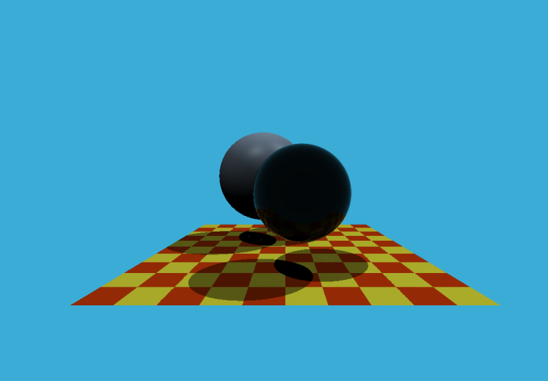
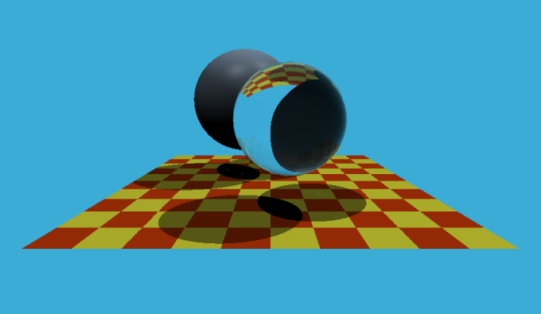
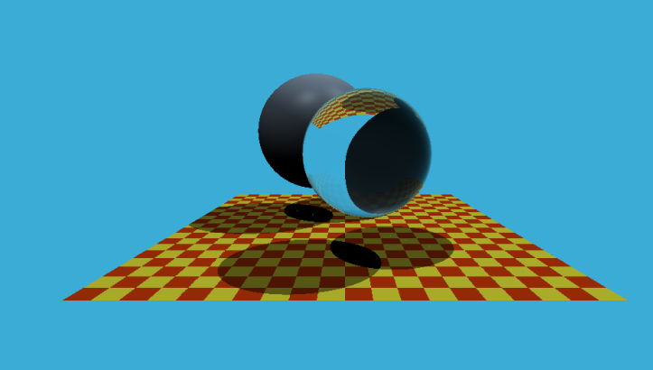

hk5 实现了光线追踪技术 并不是简单的whitted style ray tracing(一次追踪), 可以调整maxDepth 实现光线的多次折射反射（没有使用渲染方程）

下图为maxdepth=1 和maxdepth=5的情形比较。

---

##### 底下的纹理图的设置，跟纹理无关但有一定想法！

改变scale的值，并不会影响底面图的面积，但会影响格子的大小，这与算法本身相关。(如下图：)

---

涵盖了坐标转换(严格推导) snell’s Law(其中的折射光线的方向严格推导) fresnel Law 还有Blinn-Phong 着色模型  的计算

包括不同材质的分析

##### 主要是计算像素点的颜色值！